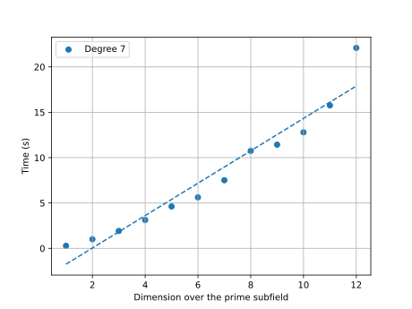

## Notes on the tests

All the tests are probabilistic in nature, trying to compute the complexity on average. We therefore used the multiprocessing module to make many simulations, but each step is done without parallel programming.

All the tests where performed on an Intel(R) Xeon(R) Silver 4214 CPU @ 2.20GHz with 48 CPUs.

All the scripts are accessible in the present folder.

## Irreducibility test

all the results used here concerning the study of generation of irreducible polynomials come from :

Gao, S., Panario, D. (1997). Tests and Constructions of Irreducible Polynomials over Finite Fields. In: Cucker, F., Shub, M. (eds) Foundations of Computational Mathematics. Springer, Berlin, Heidelberg. https://doi.org/10.1007/978-3-642-60539-0_27

In the present library (and contrary to loc. cit.), polynomial multiplication over GF(q) is done classicaly (no FFT) so the complexity for multiplication and gcd computation a O(n^2) (instead of nlog(n))..

Loc. cit., then gives a computation time for Rabin's irreducibility algorithm is O(n^3 log(log(n))log(q)) for fixed base field GF(q).

The actual depedance in time for prime fields is shown in the following figure (generated with test_irreducibility_prime.py):

Because of the extra layers necessary for general finite fields (provided by "finite_field.py"), the computation time is much bigger for the module "polynomials_finite_field.py" than for "polynomials_prime_field.py". This is shown in the following figure (generated with test_irreducibility.py)

the difference between the two comes from the intermediary module "finite_field.py" and"polynomials_finite_field.py".

## Generating GF(2^m)

According to loc.cit., irreducible monic polynomials over GF(2^m) represent a fraction 1/n of all monic polynomials. Therefore, a random generator of irreducible polynomials
of degree n takes on average n trials to find an irreducible one. 

The average complexity is therefore in O(n^4 log(log(n))log(2^m)) according to the previous section. This is shown in the following figure (generated with generation_finite_field.py)

## Generation of irreducible polynomials over GF(2^m)

The dependance of the generation of irreducible polynomials on the base field is logarithmic in the cardinality of the field according to loc.cit. (therefore linear in the dimension of the field over its prime subfield) this is shown in figure (generated with generation_irreducible.py)

## Generating speed for the binary goppa codes

The generation of goppa codes is tested via the function

    goppa.goppa(F, P, F.card)

for different fields F (of cardinal 2^m) and different irreducible polynomials (of degree t), both computed beforehand and therefore not included in the complexity. In particular, the list L of length n=2^m consists of all the elements of F.

The next step for goppa codes of type (n, n-tm, 2t+1) is to compute the all the matrices. The shape of the parity check matrix is (m, tn) and the computation of the generator matrix takes O(n^2 tm) = O(2^(2m)tm).

